# Screen and interaction specifications

The current screenshots in `screens/` are captured from the supplied HTML. They are the visual reference, not a separate application. [Design tokens](DESIGN-SYSTEM.md) and [feature catalog](FEATURE-CATALOG.md) complement these screen contracts. At runtime, content and selection explain which controls are enabled; do not maintain duplicate action implementations across surfaces.

## 01 — Welcome and learning invitation

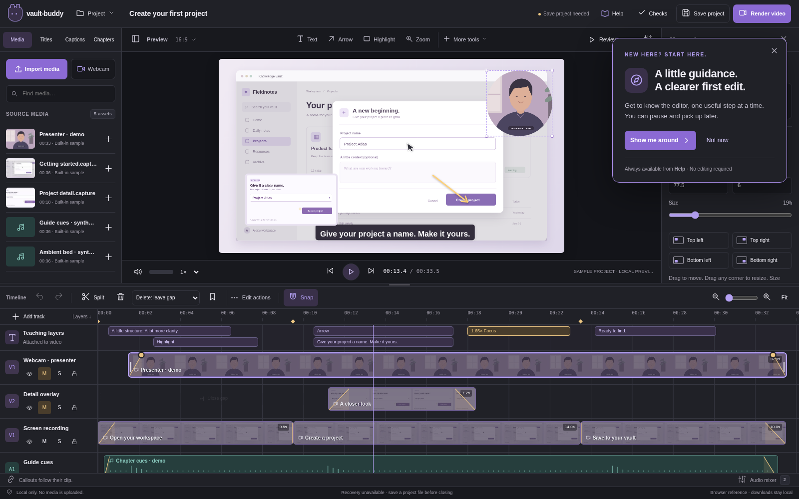

A nonmodal invitation offers Show me around / Not now over an immediately usable sample workspace. It must not steal focus, block editing, request devices or replace the sample after user work begins. The permanent Help entry remains visible after dismissal. Failure to read guide preference storage shows session-only behavior, not a crash. The generated presenter is illustrative sample content, not a captured user's webcam.

## 02 — Main editing workspace

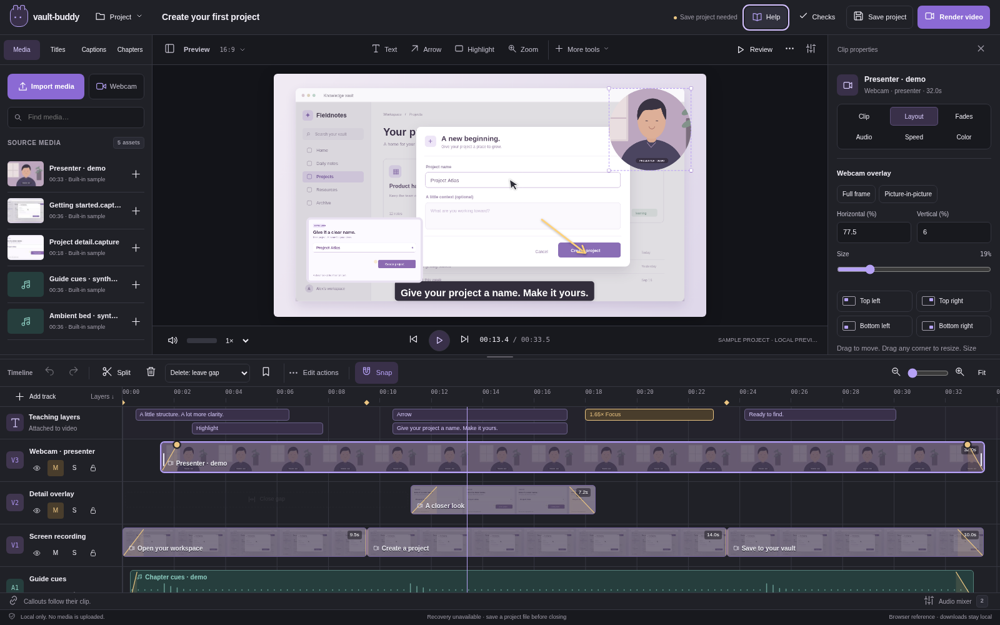

The application header owns project title/status, project menu, Help, Checks, Save project and Render video. **One row** immediately above the video owns the preview tools, aspect ratio, Review and panel controls. The library owns Media/Titles/Captions/Chapters and Import/Webcam. The timeline owns editing, selection actions, snapping and zoom. The inspector owns selected-object details; common controls remain visible, precision sections expand only as needed.

Selection is explicit and synchronized across timeline/preview/inspector. Unselected states teach what to do next rather than filling the inspector with disabled controls. Panel collapse and focus-preview layout change view state only. Primary creation actions remain reachable at compact widths through labeled overflow, not a second toolbar. Original media and saved projects are not changed by navigation, selection, seeking or theme.

## 03 — Timeline and contextual direct manipulation

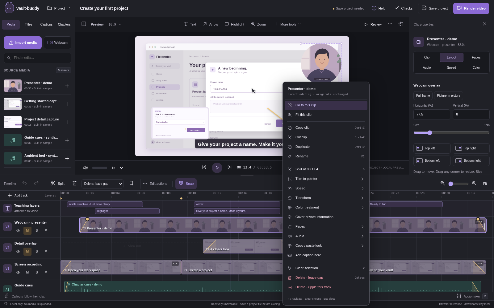

Clips show media type, selected state, trims and gold fade controls. Click/drag updates the playhead or selected object according to target. Split acts at the selected/clicked valid time; boundary/no-selection/locked cases explain why unavailable. Trim retains minimum duration and original source bounds. Drag uses preview/snap feedback; Escape cancels. Group movement preserves offsets and blocks incompatible/locked targets atomically.

Right-click operates on its actual target and pointer time, not stale selection. Context targets include clip(s), effect, video layer, track, asset and gap. The same actions are reachable from Edit actions/More and Shift+F10. Menus support arrow navigation, Home/End, Escape and focus return; disabled actions explain prerequisites. Keyboard clip nudging retains clip focus instead of switching to playhead movement after rerender. Ripple choice is visible and track-local.

## 04 — Fades, effects and inspector

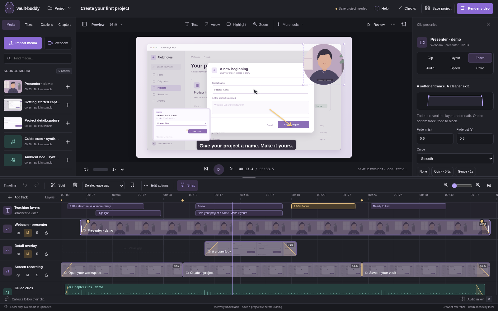

Inspector categories are Clip, Layout, Fades, Audio, Speed and Color. A control's scope is the selected object or an explicitly indicated multi-selection. Numeric entry is the alternative to dragging. Invalid input stays visible with a correction; do not silently clamp to a radically different edit without feedback. Frame/crop and source transforms remain expanded while editing the selection. Fades are different from crossfades; show numeric duration/curve and warn about track shortening where applicable.

Teaching tools add editable clip-linked cues. Arrows expose endpoints; text and numbered steps expose copy/style; highlights and spotlights expose bounds; zoom exposes focal point/factor/ramp; privacy cover is clearly stationary. Preview handles are never part of the encoded output. After changing aspect ratio, request review of crop/text/caption layout rather than pretending every design remains correct.

## 05 — Webcam capture and placement

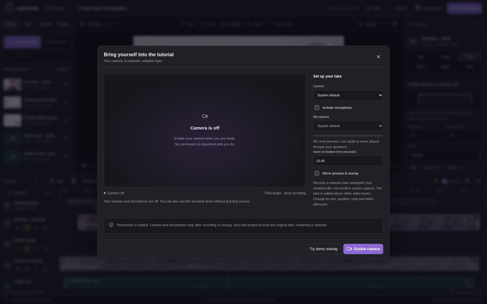

Opening Webcam shows idle explanation and explicit enable controls; it does not access the camera. Device selection, optional microphone, countdown, record/stop, cancel, review/retake and add-to-timeline are distinct states. Permission/device errors leave existing project work intact. Closing stops live resources and handles unsaved take choices. On add, the recording becomes an independent visual source/clip, not baked into the screen capture.

Drag/resize in preview or enter numeric values. Offer corner placement presets, rectangle/rounded/circle framing, crop, mirror, opacity and fades. Native synchronized screen-plus-webcam capture has a shared clock and source metadata; a later recorded take is not falsely described as synchronized acquisition.

## 06 — Captions and chapters

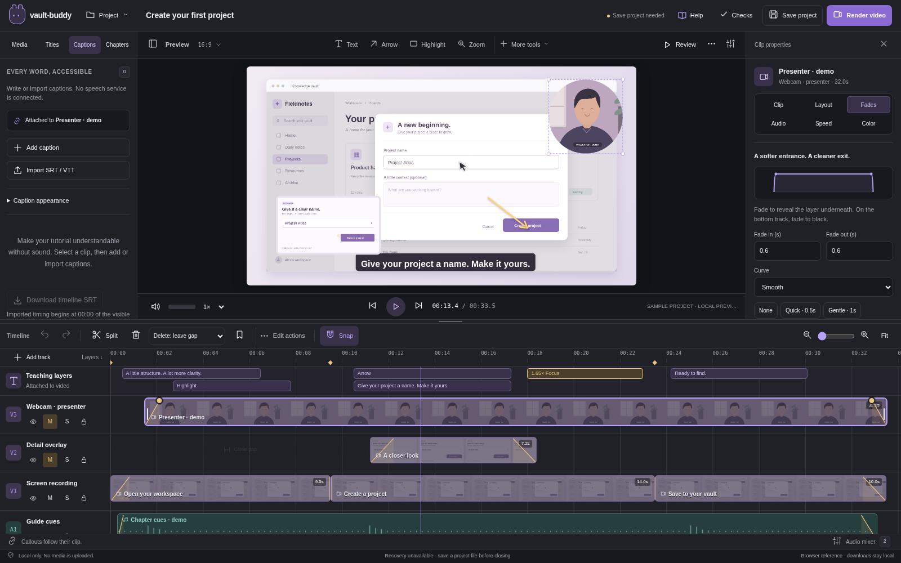

Captions are editable clip-linked cues. Import accepts supported subtitle/plain timing formats with size/error reporting. Users can add, split, time and correct cues, control burn-in/preview placement and review overlap/reading-density notices. Automatic speech recognition is not simulated as complete. Chapters bind to source positions and resolve to output times, including trims/speed/range output. Companion-note preview must match the actual included output and not embed nonexistent media.

## 07 — Checks and recovery

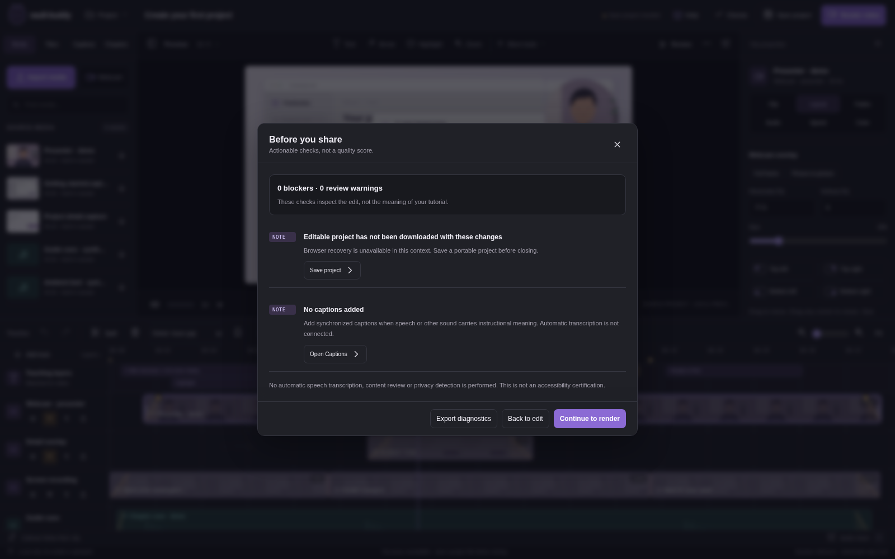

Checks shows actionable findings rather than an invented quality score: unavailable media, gaps, excluded captions, pending webcam takes, transparent clips, text collisions or audio settings. Selecting a finding reveals the relevant object/control. Warnings are not all export blockers; unsafe/unresolvable input and missing required media have explicit blocking behavior. Reconnect shows expected source metadata, batch results and ambiguity; preserve existing edits on failed import/relink.

## 08 — Save editable project

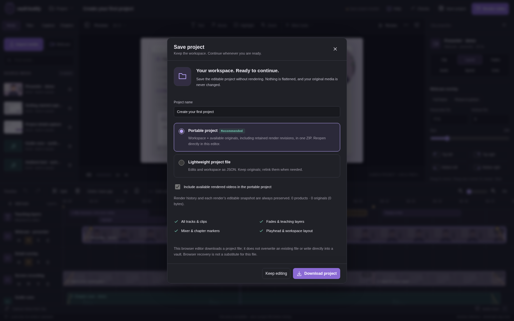

Save project is independent of rendering. Explain portable ZIP versus lightweight project JSON, included original media, retained render snapshots and reconnection needs. Options have normal-sized radio targets; dialog content scrolls while heading/actions remain reachable. Package preparation reports pending/success/failure/cancel. Browser copy says download started, not saved to vault. Native copy changes only after a matching durable receipt.

## 09 — Render and product review

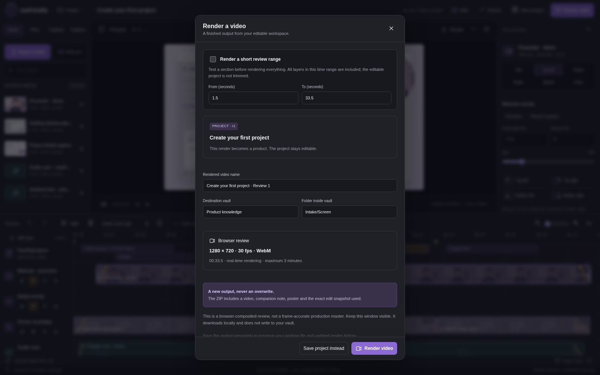

Name a product, choose supported output preferences and whole/range rendering, review checks and original-media boundary. Native progress supports cancellation and error recovery; the browser clearly labels its review limits. Completion creates a separate product with source revision/snapshot/range, not a closed editing state. Watch rendered file plays actual encoded media. Restore its edit creates new working revision; earlier product remains unchanged. Save the project afterward to retain newly created lineage.

## 10 — Interactive walkthrough

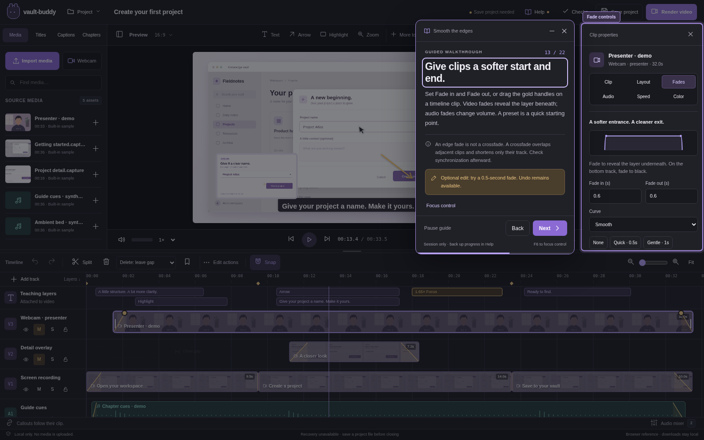

The coach explains and highlights a real visible command without automatically invoking it. Back/Next, chapter progress, pause/close and collapse remain available. F6 transfers focus to the target; user actions never auto-advance. Dialogs suspend rather than lose the lesson. [Full interaction/content contract](ONBOARDING.md).

## 11 — Learning center

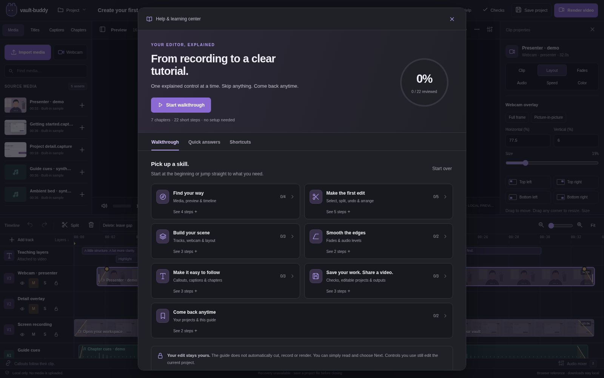

Search quick answers, select a chapter/lesson, resume exact step, inspect shortcuts/preferences or restart with confirmation. Learning progress is independent of project revisions. Progress-file fallback contains no media. Current navigation answers explain where controls are, not how the UI changed historically.

## 12 — Compact and alternate theme

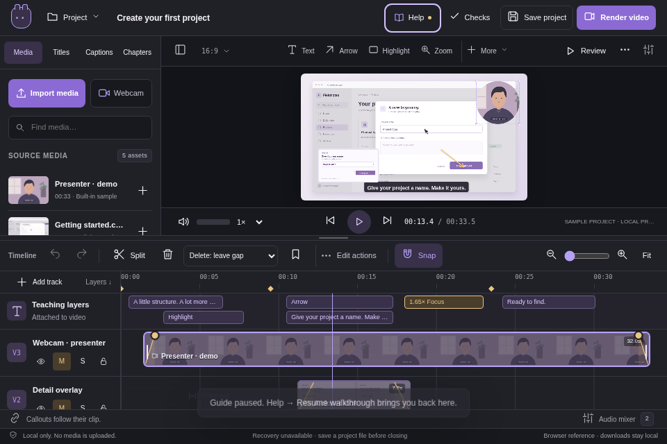

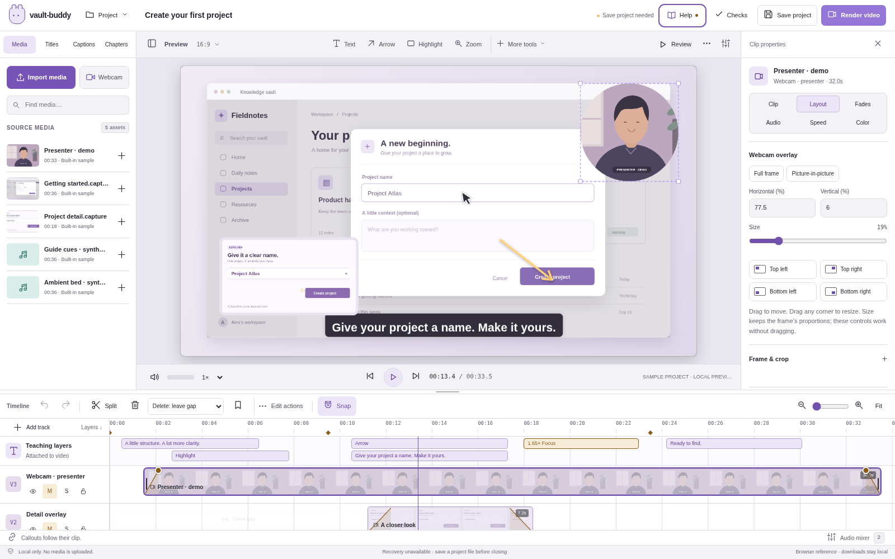

At 960×640 retain one preview toolbar and accessible primary actions. Side panels can use drawers; opening one must not hide every route back. At narrower browser widths keep tool overflow and scrollable dialogs reachable, but the supported product remains a desktop editor rather than a complete touch-first mobile editing design. Theme changes use semantic tokens; visible focus, selected tracks, critical statuses and media handles remain distinguishable. Forced-colors and reduced-motion behavior supplement, not replace, assistive-technology validation.
