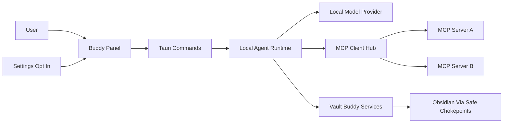

# Local MCP Hub - Product Requirements Document

- **Status:** Draft
- **Version:** 0.1
- **Parent Product:** Vault Buddy
- **Related PRD:** [AI Platform & Agent Runtime](ai-platform.md)

---

## Executive Summary

The Local MCP Hub adds an optional local assistant layer to Vault Buddy.

When explicitly enabled and configured by the user, Vault Buddy can connect a cheap local LLM to user-configured MCP servers and let the buddy use those servers as tools for knowledge ingestion, retrieval, and lightweight workflow assistance.

This is not a mandatory runtime dependency. A default Vault Buddy installation must continue to start, build, and run exactly as it does today without Ollama, LM Studio, MCP server configuration, downloaded models, or any assistant state.

## Vision

Vault Buddy becomes a local MCP client hub for personal knowledge work.

The buddy remains the visible, lightweight desktop companion. Behind it, an optional local agent runtime can route user intent to configured MCP servers, call tools with explicit permission boundaries, and turn results into safe, reviewable knowledge proposals.

The first version should optimize for simple, local, tool-using interaction rather than advanced reasoning. The model selects tools and drafts responses. Vault Buddy owns permissions, confirmation, audit, and all sanctioned writes.

## Product Goals

### Primary Goals

- Provide an opt-in local assistant mode that is disabled by default.
- Let users configure a local model provider such as Ollama or LM Studio.
- Let users configure MCP servers that Vault Buddy can connect to as a client.
- Discover MCP tools and expose a small, relevant subset to the local model.
- Support ingestion-oriented workflows that produce previews before anything is written.
- Keep all vault writes behind Vault Buddy-owned services and confirmation flows.
- Audit model requests, tool calls, approvals, failures, and user-confirmed writes.

### Secondary Goals

- Make the model provider replaceable so embedded llama.cpp can be considered later.
- Support both stdio and streamable HTTP MCP transports over time.
- Provide a foundation for future workflow automation without introducing background autonomy in the first version.
- Keep the UX understandable for users who know what MCP servers are but do not want to operate a separate agent framework.

### Non Goals

- No cloud-hosted model dependency.
- No assistant feature enabled by default.
- No autonomous background agents in the first version.
- No unrestricted shell execution.
- No direct filesystem writes into Obsidian vaults through arbitrary MCP filesystem tools.
- No requirement that Vault Buddy ships or downloads an LLM model itself.
- No replacement for external power-user MCP clients such as Cursor or Claude Desktop.

## User Experience

The feature appears in Settings as an experimental local assistant section.

Before opt-in:

- No assistant entry point is shown in the main panel.
- No local model ports are probed.
- No MCP server processes are spawned.
- No assistant configuration is required.
- No failure in this feature can affect normal vault, capture, recording, transcription, or update flows.

After opt-in:

- The user chooses a model provider type and local endpoint.
- The user selects or enters a model name.
- The user adds MCP servers with command, arguments, environment references, or HTTP endpoint.
- Vault Buddy shows each server's health, discovered tools, and permission classification.
- The panel exposes a compact assistant view only when the feature is enabled and minimally configured.
- Tool calls that can write, execute, browse, call external services, or affect a vault require explicit confirmation.

The assistant should feel like asking the buddy to use connected tools, not like opening a full IDE-grade agent environment.

## Core User Stories

- As a user, I can enable the local assistant only when I want it, so Vault Buddy remains lightweight by default.
- As a user, I can configure Ollama or LM Studio as the model provider, so I control the local model and its resource usage.
- As a user, I can add MCP servers, so Vault Buddy can use external sources such as files, calendars, issue trackers, or knowledge stores.
- As a user, I can see what tools a server exposes before the assistant uses them.
- As a user, I can ask the buddy to gather information through connected MCP servers and produce an ingestion preview.
- As a user, I must approve any action that writes data, changes state, or touches my vault.
- As a user, I can disable the feature and know that managed MCP servers and assistant sessions stop.

## Functional Requirements

### Opt-in Activation

- The local assistant has a top-level `enabled: false` default.
- Disabled mode is a first-class state, not an error state.
- Enabling requires at least a provider type and endpoint before chat is available.
- Disabling stops managed MCP server processes, cancels active assistant sessions, clears transient tool state, and hides assistant UI entry points.
- The app must not fail startup if a previously configured model provider or MCP server is unavailable.

### Model Provider

- The first provider interface targets local HTTP APIs exposed by Ollama or LM Studio.
- The implementation depends on a provider abstraction, not a specific runtime.
- The provider supports listing configured/available models when supported by the backend.
- The provider supports chat requests with tool definitions.
- Streaming responses are preferred for UX but not required for the first spike.
- Tool-call parsing must be validated deterministically before any MCP call is executed.

### MCP Server Registry

- MCP server configuration is stored app-side, not in a vault.
- Each server has a user-visible name, enabled flag, transport type, command or endpoint, arguments, environment references, timeout, and permission policy.
- Vault Buddy can connect to enabled servers only after the local assistant is enabled.
- Vault Buddy discovers tools and resources and caches enough metadata to display them in settings.
- Server stderr and startup failures are logged through existing diagnostics.
- Long-running or hung server/tool calls must time out and surface a user-visible failure.

### Tool Permissions

Each discovered tool is classified before use:

- Read-only
- Write or mutate
- External side effect
- Shell or process execution
- Browser or network access
- Vault-affecting
- Unknown

Read-only tools may be allowed with lower friction once the user trusts a server. All other classes require explicit confirmation before execution. Unknown tools are treated as risky.

### Assistant Interaction

- The assistant view is available only after opt-in and minimal configuration.
- The assistant shows model status and MCP server status.
- The assistant renders tool-call chips with server name, tool name, risk class, and state.
- Risky tool calls pause for user approval.
- Failed tool calls produce visible, non-fatal errors.
- The assistant should expose a narrow tool set per turn where possible, reducing the burden on small local models.

### Ingestion Preview

Ingestion flows produce a preview before any write:

- Source and server used
- Suggested title
- Extracted facts or summary
- Suggested target vault and folder
- Proposed note body
- Required write action

The user must confirm before Vault Buddy writes anything. Confirmed writes go through Vault Buddy-owned services, not arbitrary MCP filesystem tools.

## Architecture

The recommended architecture is a Rust-owned local agent runtime behind Tauri IPC.

The Rust side owns process supervision, logging, permissions, audit, model calls, MCP clients, and safe handoff to Vault Buddy services. The Vue side owns settings, status display, chat interaction, approval prompts, and previews.

The first implementation should use external local model providers rather than embedding model inference in the Tauri process. This keeps the app lightweight and avoids making model runtime setup part of the core Vault Buddy installation.

## Safety And Privacy

- All model and MCP activity is local unless the user configures an MCP server that calls external services.
- Vault Buddy must make external side effects visible before execution.
- No MCP server receives broad vault write capability by default.
- Every tool call is audited with server, tool, argument summary, permission decision, approval state, result state, and timestamp.
- Sensitive arguments should be summarized or redacted in logs when possible.
- Managed MCP server processes should inherit only explicitly configured environment values.
- The assistant must degrade gracefully when providers or servers are offline.

## Phased Delivery

### Phase 1 - Inert Configuration

- Add disabled-by-default configuration.
- Add settings UI for opt-in, provider endpoint, model name, and server definitions.
- Verify normal startup does not initialize the assistant runtime.

### Phase 2 - Read-only MCP Spike

- Connect to one configured stdio MCP server behind the opt-in gate.
- List tools and display health state.
- Call a harmless read-only tool from Rust and log the result.

### Phase 3 - Local Model Adapter

- Add Ollama or LM Studio-compatible model provider adapter.
- Send a small tool set to the model.
- Parse and validate tool calls.

### Phase 4 - Assistant UI

- Add a compact assistant panel view.
- Show streaming or incremental responses if supported.
- Render tool-call state and approval prompts.

### Phase 5 - Ingestion Preview

- Convert tool results into structured ingestion previews.
- Require confirmation before writes.
- Route confirmed writes through Vault Buddy-owned services.

### Phase 6 - Audit And Hardening

- Add audit records.
- Add timeouts and process cleanup.
- Add tests for disabled-by-default behavior, config parsing, permission classification, feature-gated UI, approval prompts, and preview confirmation.

## Success Metrics

- Vault Buddy starts and functions normally with the feature disabled.
- Users can enable the feature and connect at least one local provider and one MCP server.
- The hub can discover and display tools from a configured MCP server.
- The model can successfully request a read-only tool call in a constrained test flow.
- Risky tools are never executed without confirmation.
- Confirmed ingestion writes preserve existing vault safety invariants.
- Disabling the feature reliably stops managed processes and hides assistant UI.

## Open Questions

- Which provider should be implemented first: Ollama, LM Studio, or an OpenAI-compatible local endpoint abstraction?
- Which MCP SDK should be used in Rust for the first spike?
- Should MCP server configuration support importing Claude Desktop-style MCP JSON?
- How much conversation history should be persisted, if any?
- Should audit records live in the existing app log, a separate assistant audit file, or both?
